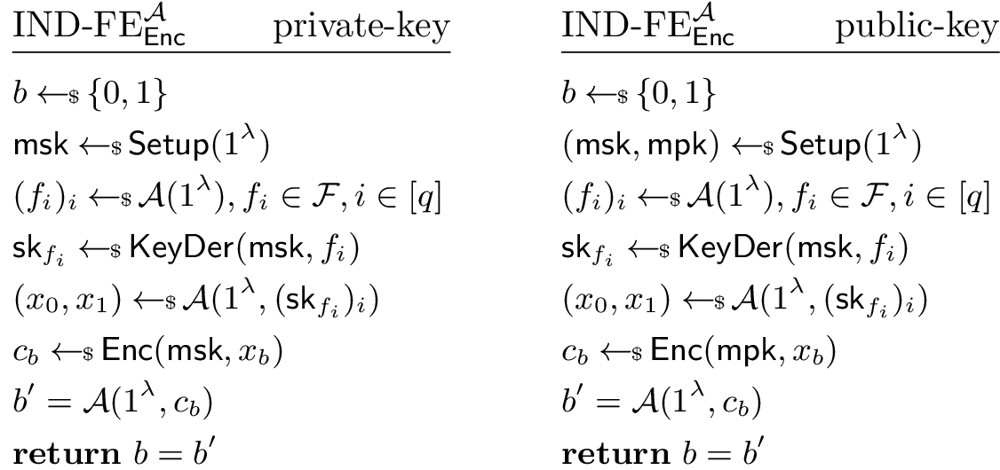

* TOC
{:toc}

## Introduction

Functional encryption (FE) is an ambitious paradiagm for public-key encryption
that enables fine-grained control of access to encrypted data. More
specifically, given an encryption $\Enc(x)$ of a value $x$, and a secret key
$\sk_f$ for a function $f$ genereated by the owner of a master key
$\msk$, anyone can reveal the compuation of $f(x)$ with learning any
other information of $x$.

## Syntex and Security
The formal treatment of FE was initialed by [TCC11] and [O'N10] by putting forth
precise definitions of the concepts and two security notions, namely,
*indistinguishability*(IND)-based security and *simulation*(SIM)-based security.

### Syntex of FE
A functional encryption for a family of function $\mathcal{F}$ is defined as a tuple of PPT algorithms $(\Setup,\Enc,\KeyDer,\Dec)$, where

* $\msk \gets \Setup(1^\lambda)$: generate a master key;
* $c \gets \Enc(\msk, x)$: encrypt message $x$;
* $\sk_f \gets \KeyDer(\msk, f)$: generate a secret
  functional key for function $f \in \mathcal{F}$;
* $y \gets \Dec(\sf{sk}_f,c)$: evaluate $f(x)$ through $\sk_f$ and $c$.

#### Public Setting FE
The above syntax, called private-key FE, has a limitation that only the owner of
$\msk$ can encrypt a
message $x$. However, in a public-key setting, an FE scheme enables anyone generate
the encryption of a message $x$ and the holder of the functional key $\sk_f$ to
reveal the value of $f(x)$. Essentially, a PK setting FE has a similar syntax,
except that:

* $(\msk,\mpk) \gets \Setup(1^\lambda)$: generate a master and a pulbc key pair;
* $c \gets \Enc(\mpk, x)$: encrypt message $x$ using the public encryption key.

### Securiy

#### IND-Based Security
The IND-based secrurity formulates that it is infessible to distinguish
encryption of any two messages, without get a secret key that decrypts
ciphertexts to distinct values.

Obviously, if an adversary has a functional key $\sk_{f}$ for which
$f(x_0) \neq f(x_1)$, then he can easily answer the challenge $c$ by output $b'$
if $\Dec(\sk_f,c_b) = f(x_b)$. Hence, we must severly restrict the attacker's
choice of $x_0,x_1$ satisfying

$$f(x_0) = f(x_1).$$

for all the $f \in \mathcal{F}$ for which the adversary have the key $\sk_f$.
In the public-key setting, the adversary is even more restrictive. Basiclly, for
any message $x \in \mathcal{X}$, and any two functions $f_1,f_2$ queried by the adversary, it
requires that

$$f_1(x) = f_2(x).$$

[TCC11] further shows that IND-based security is inadequate for certain
functionalities, e.g., one-way permutations, as a trivail construction statisfy
it but is insecure. Nevertheless, for functionalities such as predicate
encryption with public index we show in Section 5 that Definition 3 is
adequate.

#### SIM-Based Security
The SIM-based security dipicts that the existence of an efficient simulator that
given the a list of functions $f_1,\cdots,f_n$, outputs the view of the
colluders that are given an encryption of $x$ toghther with secret keys
$\sk_{f_1},\cdots,\sk_{f_q}$.

### Adaptive and Non-Adaptive

### _One-or-Many_

## References

- [TCC11] Boneh, Sahai, and Waters. **Functional encryption: Definitions and
  challenges.** [ia.cr/2010/543](https://eprint.iacr.org/2010/543)
> We initiate the formal study of functional encryption by giving precise
> definitions of the concept and its security. Roughly speaking, functional
> encryption supports restricted secret keys that enable a key holder to learn a
> specific function of encrypted data, but learn nothing else about the
> data. For example, given an encrypted program the secret key may enable the
> key holder to learn the output of the program on a specific input without
> learning anything else about the program.
>
> We show that defining security for functional encryption is
> non-trivial. First, we show that a natural game-based definition is inadequate
> for some functionalities. We then present a natural simulation-based
> definition and show that it (provably) cannot be satisfied in the standard
> model, but can be satisfied in the random oracle model. We show how to map
> many existing concepts to our formalization of functional encryption and
> conclude with several interesting open problems in this young area.

- [O'N10] O'Neil. **Definitional Issues in Functional Encryption**
  [ia.cr/2010/556](https://eprint.iacr.org/2010/556.pdf)
> We provide a formalization of the emergent notion of "functional
> encryption", as well as introduce various security notions for it, and study
> relations among the latter. In particular, we show that indistinguishability
> and semantic security based notions of security are  _inequivalent_ for
> functional encryption in general; in fact, "adaptive" indistinguishability
> does not even imply "non-adaptive" semantic security. This is alarming given
> the large body of work employing (special cases of) the former. We go on to
> show, however, that in the "non-adaptive" case an equivalence does hold
> between indistinguishability and semantic security for what we call
> _preimage sampleable_ schemes. We take this as evidence that for preimage
> sampleable schemes an indistinguishability based notion may be acceptable in
> practice. We show that some common functionalities considered in the
> literature satisfy this requirement.

- [C13] Agrawal, Gorbunov, Vaikuntanathan, and Wee. **Functional encryption:
  New perspectives and lower bounds.**
  [ia.cr/2012/468](https://eprint.iacr.org/2012/468)
>
> Functional encryption is an emerging paradigm for public-key encryption that
> enables fine-grained control of access to encrypted data. In this work, we
> present new perspectives on security definitions for functional encryption, as
> well as new lower bounds on what can be achieved. Our main contributions are
> as follows:
>
> * We show a lower bound for functional encryption that satisfies a weak
>   (non-adaptive) simulation-based security notion, via pseudo-random
>   functions. This is the first lower bound that exploits unbounded collusions
>   in an essential way.
> * We put forth and discuss a simulation-based notion of security for
>   functional encryption, with an unbounded simulator (called USIM). We show
>   that this notion interpolates indistinguishability and simulation-based
>   security notions, and has strong correlations to results and barriers in the
>   zero-knowledge and multi-party computation literature.

- [STOC13] Goldwasser, Kalai, Popa, Vaikuntanathan, and Zeldovich. **Reusable
  Garbled Circuits and Succinct Functional Encryption.**
  [ia.cr/2012/733](https://eprint.iacr.org/2012/733)
